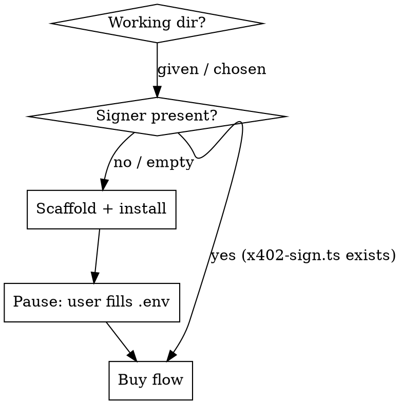

# x402-pay

## Overview

Lets an agent buy an x402-protected resource on Hedera testnet by driving the HTTP flow itself while a separate signer process holds the key. The agent pipes the 402 challenge through the signer and gets back a payment header — **the private key never reaches the agent/LLM context**.

Core boundary: agent does HTTP; the local `x402-sign.ts` process does the signing from `.env`.

## When to Use

- User wants an agent to pay-per-call an x402 endpoint (`402 Payment Required` with a `payment-required` header).
- Network is `hedera:testnet`, scheme `exact`, asset HBAR.

Not for: x402 on EVM chains, or production custody (swap the signer for HSM/KMS/Hiero CLI behind the same `ExactHederaScheme` interface).

## Flow



### 1. Resolve the working directory

- **Path given as argument** → `ls` it.
  - Contains `x402-sign.ts` → signer ready, **skip to step 4**.
  - Empty / no signer → use it for setup (step 2).
- **No path given** → ask the user (SELECT): point to an existing dir, or create one (default `~/x402-signer`). Then `mkdir -p` it.

### 2. Scaffold the signer

Copy the scaffold (including dotfiles) from this skill's `signer/` into the working dir, then install. `node` 24+ runs the `.ts` directly — no `tsx` needed.

```bash
cp -a "<skill-dir>/signer/." "<workdir>/"
cd "<workdir>" && pnpm install && cp .env.example .env
```

### 3. Pause for credentials — DO NOT proceed alone

Tell the user to fill `<workdir>/.env` with a **funded ECDSA testnet** account:
- `HEDERA_CLIENT_ID` (e.g. `0.0.xxxxx`) and `HEDERA_CLIENT_KEY`.
- Test HBAR + account from the Hedera Portal.

**Then STOP and wait for the user to confirm they've filled it.** Never read, `cat`, echo, or ask for the key value — it stays in `.env`, read only by the signer process.

### 4. Buy flow

Need the **API base URL** (skill argument). If missing, ask the user. Then:

```bash
BASE="<base-url>"            # e.g. http://localhost:4021

# a. Discover products, present them, let the user pick product + params
curl -s "$BASE/catalog"

# b. Build the resource URL from the choice
URL="$BASE/data/<product>?<param>=<value>"

# c. Trigger 402, capture the payment-required header
PR=$(curl -s -D - -o /dev/null "$URL" \
  | grep -i '^payment-required:' | sed 's/^[^:]*:[[:space:]]*//' | tr -d '\r')

# d. Delegate signing (key stays in the signer process)
SIG=$(printf '%s' "$PR" | node "<workdir>/x402-sign.ts")

# e. Retry with the signature → 200 + data, settlement in payment-response
curl -s -i "$URL" -H "payment-signature: $SIG"
```

Decode the `payment-response` header (base64 JSON) to report the result: `success`, `payer`, `transaction` (the Hedera tx id), `network`.

## Quick Reference

| Step | Command |
|---|---|
| Scaffold | `cp -a <skill-dir>/signer/. <workdir>/` |
| Install | `pnpm install && cp .env.example .env` |
| Sign | `printf '%s' "$PR" \| node <workdir>/x402-sign.ts` |
| Pay | `curl -s -i "$URL" -H "payment-signature: $SIG"` |

## Common Mistakes

- **Signing too early.** The signed payload expires after `maxTimeoutSeconds` (180s). Sign right before the retry, not before discovery.
- **ED25519 account.** The signer defaults to ECDSA (`fromStringECDSA`). An ED25519 key needs `fromStringED25519` in `x402-sign.ts`.
- **No network on the API server.** If the retry returns 402 with error `"fetch failed"`, the resource server can't reach the facilitator — that's a server-side network issue, not the signature.
- **Touching the key.** Don't `cat .env` or print the key to satisfy "verification". Verify only that the file is filled, never the value.
